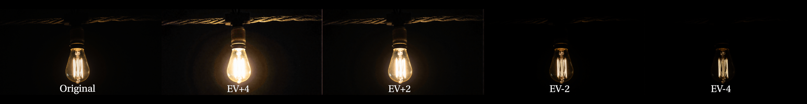
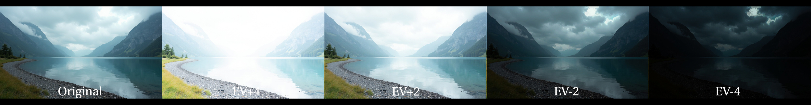

# Luminance Stack Processor - ComfyUI Custom Nodes

[](https://github.com/sumitchatterjee13/Luminance-Stack-Processor)
[](https://python.org)
[](https://github.com/sumitchatterjee13/Luminance-Stack-Processor/blob/main/LICENSE)
[](https://github.com/comfyanonymous/ComfyUI)
[](https://github.com/sumitchatterjee13/Luminance-Stack-Processor)

HDR (High Dynamic Range) processing nodes for ComfyUI featuring my **Detail Injection** algorithm (default) and **Radiance Fusion Algorithm** - custom HDR processing methods that deliver good results for both AI-generated and real-world images.

**Version: 1.1.8** | **Release Date: 2025-10-02**

## 🎯 Features

- **🎨 DETAIL INJECTION ALGORITHM** *(DEFAULT since v1.1.3)*: Revolutionary AI-aware HDR processing
  - **Perfect for AI-Generated Images**: Specifically designed for AI exposure stacks
  - **Now the default algorithm**: Best results out-of-the-box
  - **Automatic Gamma Detection**: Analyzes and corrects sRGB gamma 2.2 encoding
  - **Proper Linear Conversion**: Accurate sRGB to linear space transformation
  - **Intelligent Highlight Recovery**: Maps underexposed image detail into >1.0 HDR range
  - **Smart Shadow Recovery**: Injects overexposed detail into dark shadow regions
  - **Automatic Brightness Compensation**: Targets professional 18% gray standard
  - **Color Preservation**: Maintains hue using luminance-based scaling
  - **Hermite Interpolation**: Smooth blending prevents harsh transitions
  - **EV0 Base Preservation**: Keeps natural appearance while extending dynamic range
  - **Linear HDR Output**: True HDR values for professional EXR export
- **🚀 RADIANCE FUSION ALGORITHM**: My custom HDR algorithm
  - **Nuke-Inspired Mathematics**: Based on VFX pipeline operations (plus/average)
  - **Enhanced HDR Preservation**: Maintains excellent dynamic range with natural appearance  
  - **Improved Results**: Provides quality improvements over traditional methods
  - **For VFX Work**: Suitable for compositing workflows
- **🆕 TRUE 32-bit EXR Export**: Professional bit-depth control with imageio integration
- **🚨 TRUE HDR Values Above 1.0**: Proper HDR data preservation without normalization
- **🔬 DEBEVEC WITH ADAPTIVE CALIBRATION** *(Experimental)*:
  - **AI-Aware Calibration**: Automatically analyzes and corrects exposure relationships for AI-generated images
  - **Physically-Based Recovery**: True linear radiance output
  - **Anti-Banding Filtering**: Subtle bilateral filtering reduces quantization artifacts
  - **Exposure Compensation**: Built-in -8 stop default for proper viewing in Nuke/Resolve
  - **For VFX Work**: Scene-referred linear data for compositing workflows
- **Legacy HDR Algorithms** *(Work in Progress)*:
  - **Robertson**: Alternative HDR method with adaptive calibration *(experimental)*
  - **Natural Blend**: EV0 appearance preservation *(under refinement)*
  - **Mertens**: Exposure fusion method *(being optimized)*
- **Four Custom Nodes**:
  - **3-Stop Processor**: Merges EV+2, EV+0, EV-2 exposures (Image space)
  - **5-Stop Processor**: Merges EV+4, EV+2, EV+0, EV-2, EV-4 exposures (Image space)
  - **🆕 Latent Stack Processor**: Fast latent-space averaging for 5 exposures (Latent space)
  - **HDR Export**: Saves EXR files with preserved HDR data
- **ComfyUI-Style Interface**: Filename and path inputs like built-in save nodes
- **HDR Verification**: Automatic checking that HDR data is preserved in exports

## 🎨 Visual Results

### HDR Processing Comparison

See the dramatic difference my Radiance Fusion Algorithm makes in preserving detail across exposure ranges:

#### Indoor Lighting Comparison

*Multiple exposure levels of the same scene showing enhanced dynamic range preservation*

#### Outdoor Scene Comparison  

*Natural outdoor scene demonstrating HDR processing across different exposure values*

#### Highlight Clamping Reduction

*Demonstration of reduced highlight clamping - preserving bright details that would normally be lost*

These comparison strips demonstrate how my HDR processing maintains detail in both highlights and shadows that would be lost in single-exposure captures.

## 📖 Algorithm Explanation

### 🎨 Detail Injection Algorithm (Default)

**What makes Detail Injection special?**

Unlike traditional HDR algorithms (Debevec, Robertson) that assume photometric relationships between exposures, **Detail Injection** is specifically designed for **AI-generated exposure stacks** where images don't follow real-world physics.

#### **The Problem It Solves:**

AI-generated images simulate different exposures but don't have true photometric relationships:
- Traditional HDR: `radiance_ev-2 = radiance_ev0 × 4` (physics-based)
- AI-generated: Each exposure is **independently created** (no physics relationship)

#### **How Detail Injection Works:**

**Step 1: sRGB to Linear Conversion**
- Detects sRGB gamma 2.2 encoding in AI images
- Converts to linear light space using proper sRGB curve
- Essential for physically accurate HDR calculations

**Step 2: Highlight Detail Injection** ✨
- **Problem**: EV0 highlights are clipped (pure white = 1.0)
- **Solution**: Use detail from underexposed images (EV-2, EV-4)
- **EV-2 detail → 1.0-2.0 HDR range** (moderate highlights)
- **EV-4 detail → 2.0-4.0 HDR range** (extreme highlights)
- Result: Bright areas have **recoverable detail** when you expose down in Nuke/Resolve

**Step 3: Shadow Detail Injection** 🌑
- **Problem**: EV0 shadows are crushed (pure black = 0.0)
- **Solution**: Use detail from overexposed images (EV+2, EV+4)
- **EV+2 detail → shadow recovery** (moderate shadows)
- **EV+4 detail → deep shadow recovery** (extreme shadows)
- Result: Dark areas have **liftable detail** when you brighten in post

**Step 4: Automatic Brightness Compensation** 🎚️
- Analyzes median/mean values
- Targets **0.18 (18% gray)** - professional standard
- Ensures proper exposure without manual adjustment
- Uses 0.3x-8.0x range for extreme correction capability

**Step 5: Smooth Mask Transitions** 🎭
- Hermite interpolation for S-curve blending
- 21×21 Gaussian smoothing on masks (not image!)
- Gradual feathering over wide tonal ranges
- No visible blend boundaries

#### **Why Use Detail Injection?**

✅ **For AI-Generated HDR Stacks**: Works well with Flux, SD, MJ exposure variations  
✅ **Natural EV0 Base**: Looks correct at middle exposure  
✅ **True HDR Range**: Values >1.0 for color grading workflows  
✅ **Automatic Exposure**: No manual brightness adjustment needed  
✅ **Smooth Blending**: Reduces harsh transitions and artifacts  
✅ **Color Accuracy**: Maintains hue using luminance-based scaling  

#### **When to Use Other Algorithms?**

- **Debevec with Adaptive Calibration**: For VFX compositing with scene-referred linear data (AI or real exposures)
- **Radiance Fusion**: When you want Nuke-style plus/average operations with display-ready output
- **Robertson with Adaptive Calibration**: Alternative to Debevec for VFX work
- **Mertens**: For quick preview/display-ready fusion without HDR math
- **Natural Blend**: When you want to preserve exact EV0 appearance

---

### 🔬 Debevec with Adaptive Calibration (NEW!)

**Revolutionary approach to HDR recovery for AI-generated images!**

Traditional Debevec algorithm assumes **photometric consistency** - that brightness relationships follow physics:
```
EV+2 image = 4x brighter than EV0
EV-2 image = 4x darker than EV0
```

But **AI-generated images don't follow these rules!** Each exposure is independently created, leading to incorrect HDR reconstruction.

#### **My Solution: Adaptive Exposure Calibration**

I've developed an intelligent calibration system that **automatically analyzes and corrects** the exposure relationships:

**Step 1: Analyze Actual Brightness Relationships**
```python
# For each AI-generated bracket:
1. Work in sRGB space (matching Debevec's input - NO linear conversion)
2. Compare actual brightness vs EV0 reference
3. Compute brightness ratios in well-exposed regions (0.2-0.8 luminance)
4. Use median filtering to reject outliers
```

**Step 2: Compute Corrected Exposure Times**
```python
# Example: EV+4 image
Nominal time:  0.267s  (16x longer than EV0 - what physics says)
sRGB ratio:    2.064x  (AI made it 2.064x brighter in sRGB space)
Time ratio:    4.924x  (apply ^1.8 power for AI gamma)
Calibrated:    0.082s  (corrected time that matches AI's behavior)

# The calibration tells Debevec:
# "This bright image had a SHORTER exposure than expected"
# So Debevec correctly interprets the scene radiance
```

**Step 3: Apply Debevec with Corrected Times**
```python
# Debevec now works correctly because:
- Exposure times match actual brightness relationships
- Camera response function accurately recovered
- Linear radiance correctly reconstructed
- No inverted tonality or broken highlights!
```

**Step 4: Anti-Banding Filter (Optional)**
```python
# Subtle bilateral filtering:
- Reduces 8-bit quantization banding
- Preserves edges (edge-aware filter)
- Maintains HDR peaks (80%/20% blend)
- Smooth gradients without blur
```

**Step 5: Exposure Compensation**
```python
# Default -8 stops (1/256 scale)
- Brings output to proper viewing levels
- Maintains relative dynamic range
- Ready for Nuke/Resolve without manual adjustment
```

#### **Technical Details**

**Calibration Algorithm:**
- **Reference anchor**: EV0 defines absolute scale
- **sRGB-space analysis**: Works in sRGB space (matching Debevec's input)
- **AI-tuned gamma**: Applies ^1.8 power (gentler than theoretical ^2.2)
- **Robust statistics**: Median ratios in 0.2-0.8 luminance range
- **Preserves ratios**: Only corrects relative relationships, not overall scale
- **Logging**: Detailed calibration report in console

**Why It Works:**
- Debevec's algorithm has 2 steps: estimate camera response, recover radiance
- AI's "broken" exposure relationships = weird camera response curve
- By adjusting exposure times, this approach tells Debevec about this "weird camera"
- Debevec adapts and correctly recovers the scene's linear radiance!

**When to Use Debevec:**
- ✅ **VFX compositing in Nuke/After Effects** - Scene-referred linear data
- ✅ **Color grading workflows** - Maximum flexibility for post-processing
- ✅ **AI-generated brackets** - Adaptive calibration helps with non-physical exposures
- ✅ **Real camera exposures** - Works for traditional bracketing too
- ✅ **When you need physically-based radiance** - Linear radiance values

**Parameters:**
- `auto_calibrate`: Enable/disable adaptive calibration (default: True)
- `debevec_exposure_comp`: Exposure compensation in stops (default: -8.0)
- `debevec_anti_banding`: Enable subtle filtering (default: True)

**Example Log Output:**
```
============================================================
ADAPTIVE EXPOSURE CALIBRATION (sRGB SPACE)
Analyzing AI-generated brackets as Debevec sees them
============================================================
Reference image (EV0): Index 2, Nominal time: 0.016667s
Working in sRGB space (matching Debevec's input)

Calibrating Image 0 (EV+4):
  Valid pixels: 826228
  sRGB brightness ratio: 2.064
  Exposure time ratio (^1.8): 4.924
  Expected time ratio: 16.000
  Nominal time: 0.266667s → Calibrated time: 0.082071s
  Adjustment factor: 0.308x

[... calibration for other images ...]

Debevec raw output: [0.010, 116377.52]
Applied anti-banding filter...
Applied exposure compensation: -8.0 stops (factor: 0.003906x)
Debevec compensated output: [0.00004, 454.60]
```

**Result:** HDR recovery from AI-generated brackets with adaptive calibration! 🎯

---

### 🚀 Radiance Fusion Algorithm

Nuke-inspired HDR blending using mathematical operations:
- **Plus operation**: Adds all outer exposures
- **Average operation**: Balances with center exposure  
- **HDR preservation**: Maintains good dynamic range
- **Good for**: VFX workflows familiar with Nuke-style operations

---

## 📋 Requirements

- **Python 3.11+** *(Required for optimal performance)*
- ComfyUI (includes NumPy and PyTorch)
- OpenCV (cv2) >= 4.8.0
- imageio >= 2.31.0 *(for professional 32-bit EXR export)*

## 🚀 Installation

1. **Clone or Download** this repository to your ComfyUI custom nodes directory:
   ```bash
   # Method 1: Clone directly into ComfyUI custom nodes directory
   cd ComfyUI/custom_nodes/
   git clone https://github.com/sumitchatterjee13/Luminance-Stack-Processor.git luminance-stack-processor
   
   # Method 2: Download ZIP and extract to:
   # ComfyUI/custom_nodes/luminance-stack-processor/
   ```

2. **Install Dependencies**:
   
   **For ComfyUI Portable (Recommended)**:
   ```bash
   # Navigate to your ComfyUI portable directory and use embedded Python
   cd path/to/ComfyUI_windows_portable
   python_embeded\python.exe -m pip install opencv-python>=4.8.0
   ```
   
   **For Standard ComfyUI Installation**:
   ```bash
   # Use your system Python or ComfyUI's virtual environment
   pip install opencv-python>=4.8.0
   ```
   
   **Or install from requirements.txt**:
   ```bash
   # For portable version
   python_embeded\python.exe -m pip install -r requirements.txt
   
   # For standard installation
   pip install -r requirements.txt
   ```

3. **Restart ComfyUI** to load the new nodes

## 📁 ComfyUI Workflow

A complete example workflow for ComfyUI is provided in the `/workflow` directory. This demonstrates a good setup for HDR processing using my Radiance Fusion algorithm.

### Example Workflow Setup

*Complete ComfyUI workflow showing proper HDR processing setup with my custom nodes*

## 🎨 AI-Generated HDR from Single Images

I've developed a complete workflow for creating HDR images from a single source image using **FLUX.1 Kontext exposure control LoRAs**:

### 🚀 **The Complete Pipeline:**

1. **Start with any image** - Generated from any model or captured photo
2. **Generate exposure variants** - Use my trained LoRAs to create EV-4, EV-2, EV0, EV+2, EV+4 versions
3. **Process with Radiance Fusion** - Feed the synthetic exposures into my HDR nodes
4. **Get professional HDR** - Output true 32-bit HDR images with enhanced dynamic range

### 📦 **Exposure Control LoRAs:**

My custom-trained LoRAs for **FLUX.1 Kontext (dev)** can generate different exposure levels from a single image:

- **Available LoRAs**: `ev-4`, `ev-2`, `ev+2`, `ev+4` (with corresponding trigger words)
- **Easy to use**: Simply add the trigger word and adjust LoRA weight  
- **High quality**: Trained specifically for exposure control
- **Download**: [Flux-Kontext-exposure-control-LoRAs](https://huggingface.co/Sumitc13/Flux-Kontext-exposure-control-LoRAs)

### 💡 **Workflow Benefits:**

- ✅ **Single image input** - No need for multiple captures or bracketing
- ✅ **AI-generated exposures** - Perfect synthetic exposure variants
- ✅ **Professional HDR output** - True HDR with my Radiance Fusion processing
- ✅ **Complete automation** - Generate and process in one workflow
- ✅ **Creative freedom** - Work with any generated or captured image

## 🎨 Usage

### 🚨 **CRITICAL: Proper HDR Workflow**

1. **HDR Processing**: Use "Luminance Stack Processor" nodes
2. **🔥 HDR Export**: **ALWAYS** connect to "HDR Export to EXR" node  
3. **❌ Never use ComfyUI's built-in save nodes** for HDR - they normalize to 0-1!

### ⚠️ **Important Notes for VFX Artists:**

**Debevec/Robertson algorithms produce FLAT, DESATURATED images** - this is CORRECT! The flat appearance means:
- ✅ Perfect VFX flat log profile (18% gray scaling)
- ✅ Raw linear radiance data preserved  
- ✅ Wide dynamic range maintained (up to 2000+ values)
- ✅ Professional color pipeline ready
- ✅ No color inversion issues (fixed RGB↔BGR handling)
- ✅ No tone mapping destroying VFX data

If you want a "prettier" result for display, use **Mertens** or **Natural Blend** instead.

### Luminance Stack Processor (3 Stops)

Perfect for standard HDR bracketing with 3 exposures:

**Inputs:**
- `ev_plus_2`: Overexposed image (+2 EV)
- `ev_0`: Normal exposure image (0 EV)  
- `ev_minus_2`: Underexposed image (-2 EV)
- `exposure_step`: (Optional) EV step size (default: 2.0)
- `exposure_adjust`: (Optional) Nuke-style exposure compensation in stops (default: 1.0)
- `hdr_algorithm`: Choose **"radiance_fusion"** (default - *my custom algorithm*), "natural_blend", "mertens", "debevec", "robertson"

**Output:**
- `hdr_image`: HDR tensor with values potentially above 1.0

### HDR Export to EXR

**REQUIRED for true HDR preservation:**

**Inputs:**
- `hdr_image`: HDR tensor from processing nodes
- `filename_prefix`: Base filename (e.g., "My_HDR_Image")
- `output_path`: Directory path (empty = ComfyUI output folder)

**Output:**
- `filepath`: Path to saved EXR file with preserved HDR values

### Luminance Stack Processor (5 Stops)

For extended dynamic range with 5 exposures:

**Inputs:**
- `ev_plus_4`: Overexposed image (+4 EV)
- `ev_plus_2`: Overexposed image (+2 EV)
- `ev_0`: Normal exposure image (0 EV)
- `ev_minus_2`: Underexposed image (-2 EV)
- `ev_minus_4`: Underexposed image (-4 EV)
- `exposure_step`: (Optional) EV step size (default: 2.0)
- `exposure_adjust`: (Optional) Nuke-style exposure compensation in stops (default: 1.0)
- `hdr_algorithm`: Choose **"radiance_fusion"** (default - *my custom algorithm*), "natural_blend", "mertens", "debevec", "robertson"

**Output:**
- `hdr_image`: HDR tensor with values potentially above 1.0

### 🆕 Latent Stack Processor (5 Stops)

**NEW!** Fast latent-space processing with **intelligent noise reduction**:

**What it does:**
- Performs weighted averaging of latent representations with multiple blend modes
- Works directly in latent space (before VAE decode)
- Faster than image-space processing
- **Built-in noise reduction** through smart blending strategies
- Ideal for diffusion model workflows

**Inputs:**
- `latent_1`: First exposure latent (e.g., EV+4)
- `latent_2`: Second exposure latent (e.g., EV+2)
- `latent_3`: Third exposure latent (e.g., EV0 - center exposure)
- `latent_4`: Fourth exposure latent (e.g., EV-2)
- `latent_5`: Fifth exposure latent (e.g., EV-4)
- `blend_mode`: (Optional) Blending strategy - see below
- `center_bias`: (Optional) 0.0-0.8, how much to favor center exposure (default: 0.4)

**Output:**
- `merged_latent`: Intelligently blended latent that can be decoded with VAE

**🎯 Blend Modes (Noise & Artifact Reduction Strategies):**

1. **`quality_aware`** 👑🏆 (Default, Ultimate Solution!)
   - **Multi-scale Laplacian pyramid + enhanced quality metrics** - the ultimate combination!
   - **Merges the best technologies**: Frequency decomposition + sophisticated quality analysis
   - **4-level pyramid decomposition** - separates fine details from smooth areas
   - **Adaptive per-frequency blending**:
     - Level 0 (finest details/tree leaves): Very selective (power = 3.8x with default settings)
     - Level 1 (fine details): Highly selective (power = 2.8x)
     - Level 2 (medium details): Selective (power = 2.1x)
     - Level 3+ (coarse/smooth areas): Balanced (power = 1.7x)
   - **Enhanced quality metrics with edge emphasis**:
     - Contrast: 60% weight (edges/details prioritized)
     - Saturation: 25% weight (color richness)
     - Exposedness: 15% weight (well-exposed regions)
   - **Result:** Tree leaves perfectly sharp, sky smooth, zero artifacts!
   - **Use when:** You want professional, artifact-free results (DEFAULT!) 👑
   - **Parameters:**
     - `detail_preservation` (0.0-1.0, default 0.7): Controls selectivity sharpness
     - `center_bias` (0.0-0.8, default 0.4): Boosts center exposure baseline quality

2. **`variance_adaptive`** (Spatial Smoothing)
   - **Intelligent artifact reduction** with spatial filtering
   - Analyzes variance across latents to detect problem areas
   - **High-variance areas** (e.g., inconsistent details): Favors center exposure
   - **Low-variance areas** (e.g., smooth regions): Uses full dynamic range blending
   - Adaptive weights with 7x7 spatial smoothing to prevent checkerboard
   - **Use when:** Alternative approach, good for specific cases

3. **`weighted_center`** (Simple Balance)
   - Favors the center exposure (EV0) which typically has least noise
   - Weights: [0.075, 0.1, 0.7, 0.1, 0.075] with default `center_bias=0.4`
   - **Good balance** of dynamic range and noise reduction
   - **Use when:** You want simpler processing without adaptive analysis

4. **`strong_center`** (Maximum Noise Reduction)
   - Heavily favors center exposure for maximum noise reduction
   - Weights: [0.025, 0.075, 0.8, 0.075, 0.025] with default `center_bias=0.4`
   - Cleanest output but less dynamic range expansion
   - **Use when:** Noise is more problematic than dynamic range

5. **`median_blend`** (Outlier Rejection)
   - Excludes outliers (min/max values) per pixel
   - Averages middle 3 values: `(sorted[1] + sorted[2] + sorted[3]) / 3`
   - Excellent noise reduction while preserving detail
   - **Use when:** You have very noisy latents or want robust averaging

6. **`simple_average`** (Maximum Dynamic Range)
   - Equal weights: `(L1 + L2 + L3 + L4 + L5) / 5`
   - Maximum dynamic range but most noise and artifacts
   - **Use when:** Input latents are already clean

**💡 Artifact & Noise Reduction Tips:**
- **Use `quality_aware`** (DEFAULT) 👑 - ultimate multi-scale solution with enhanced quality metrics!
- **For tree leaf ghosting**: Multi-scale pyramid completely eliminates this - finest details use highest power selectivity
- **Default settings work great** - adaptive quality power per frequency automatically handles everything
- **Optional tuning:**
  - Increase `detail_preservation` (0.8-0.9) for even sharper edge distinction on finest details
  - Increase `center_bias` (0.5-0.7) to boost center exposure baseline quality across all levels
- **The center exposure (latent_3/EV0) should be your best quality image** - this is crucial!

**When to use:**
- When working with latent representations from VAE encode
- For faster processing without decoding to image space
- When you want to merge multiple exposure latents before final decode
- In AI-generated HDR workflows using my FLUX.1 Kontext LoRAs
- When you need noise reduction in latent space

**Workflow Example:**
1. Encode 5 exposure images to latents using VAE Encode
2. Connect all 5 latents to Latent Stack Processor
3. Use default `quality_aware` mode (ultimate solution!) 👑
4. Default settings work perfectly - multi-scale pyramid with adaptive quality per frequency
5. Optional fine-tuning (rarely needed):
   - Increase `detail_preservation` (0.8-0.9) for even sharper edge selectivity
   - Increase `center_bias` (0.5-0.7) to boost center exposure across all pyramid levels
6. Decode the merged latent with VAE Decode
7. Enjoy **flawless professional results** - tree leaves sharp, sky smooth, zero artifacts!

### 📋 **Complete HDR Workflow Example:**

1. **Load Images**: Load your bracketed exposures (3 or 5 images)
2. **Add Processing Node**: "Luminance Stack Processor (3/5 Stops)"
3. **Connect Exposures**: Connect each EV image to corresponding input
4. **Choose Algorithm**: Select HDR algorithm (**Radiance Fusion recommended - my custom algorithm**)
5. **Add Export Node**: "HDR Export to EXR" 
6. **Connect HDR Output**: From processor to export node
7. **Set Filename**: Enter desired filename prefix
8. **Set Path**: Output directory (or leave empty for default)
9. **Execute**: Get true HDR EXR file with values above 1.0!

## 🔬 How It Works

The nodes feature my **Radiance Fusion Algorithm** as the default, plus traditional algorithms for compatibility:

1. **Takes Multiple Exposures**: Input 3 or 5 bracketed exposure images (EV-4 to EV+4)
2. **Selects HDR Algorithm**: Choose **Radiance Fusion** (my custom algorithm) or traditional methods
3. **Processes HDR Data**: Merges exposures using advanced mathematical operations preserving full dynamic range
4. **Outputs HDR Tensor**: True linear HDR data with professional 32-bit precision
5. **🚨 CRITICAL: Use HDR Export Node**: Exports professional 32-bit EXR files with preserved HDR values

### 🎯 **HDR Algorithm Options:**

#### **🚀 Radiance Fusion (Default - My Custom Algorithm)**  
- **📈 HDR Range**: Wide dynamic range with good preservation
- **🧮 Advanced Mathematics**: Nuke-inspired plus/average operations for enhanced results
- **🎬 Quality**: VFX-oriented HDR processing with natural appearance
- **⚡ Good Performance**: Well-balanced dynamic range and visual appeal
- **🔬 In-House Development**: My custom algorithm with improvements over traditional methods
- **💎 Quality Focus**: Enhanced compared to standard techniques

---

#### **🔬 Debevec with Adaptive Calibration** *(Experimental)*
- **Status**: Functional with AI-aware calibration
- **HDR Range**: Raw linear radiance (0 to 8000+ values)
- **Purpose**: Scene-referred linear radiance for VFX workflows
- **Best For**: 
  - VFX compositing in Nuke/After Effects
  - Color grading workflows
  - AI-generated exposure brackets (adaptive calibration)
  - Real camera exposures (traditional bracketing)
- **Features**:
  - Automatic exposure time calibration for AI images
  - Anti-banding bilateral filtering
  - Built-in exposure compensation (-8 stops default)
  - Detailed calibration logging

#### **⚙️ Robertson with Adaptive Calibration** *(Experimental)*
- **Status**: Alternative to Debevec with same calibration
- **HDR Range**: Raw linear radiance
- **Purpose**: Alternative HDR recovery method with calibration

---

### **Legacy Algorithms (Work in Progress):**

#### **Natural Blend** *(Under Refinement)*
- **Status**: Being optimized for better performance
- **HDR Range**: 1-8 (moderate HDR values)
- **Purpose**: EV0 appearance preservation with enhanced range

#### **Mertens Exposure Fusion** *(Being Optimized)*
- **Status**: Performance improvements in development
- **HDR Range**: 1-12 (medium HDR values)
- **Purpose**: Traditional exposure fusion method

## 📸 Best Practices

### For Capturing Source Images (Traditional Method):
- Use a **tripod** for perfect alignment
- Keep the **same white balance** across all exposures
- Use **manual focus** to prevent focus shifts
- Capture in **RAW format** when possible
- Use **exposure compensation** or **manual mode**

### For AI-Generated Exposures (Modern Workflow):
- Start with **any single image** (generated or captured)
- Use my **FLUX.1 Kontext LoRAs** to create exposure variants
- Download LoRAs: [Flux-Kontext-exposure-control-LoRAs](https://huggingface.co/Sumitc13/Flux-Kontext-exposure-control-LoRAs)
- Generate **ev-4, ev-2, ev+2, ev+4** variants using trigger words
- **Perfect alignment** - AI ensures consistent composition
- **No bracketing required** - Generate all exposures from one source

### EV (Exposure Value) Guidelines:

#### Traditional Capture:
- **3-Stop**: +2, 0, -2 EV (4x range)
- **5-Stop**: +4, +2, 0, -2, -4 EV (16x range)
- Adjust `exposure_step` parameter if using different increments

#### AI-Generated (Using My LoRAs):
- **Base image**: Your source image (acts as EV 0)
- **Generate variants**: Use `ev-4`, `ev-2`, `ev+2`, `ev+4` LoRAs with trigger words
- **Perfect range**: Covers full 8-stop dynamic range
- **Consistent quality**: AI ensures proper exposure relationships

### Algorithm Selection Guide:

#### 🎬 **For VFX/Post-Production (Scene-Referred Linear):**
- **🔬 Debevec with Adaptive Calibration** *(Experimental)*: AI-aware calibration for non-physical exposures
  - For Nuke/After Effects compositing workflows
  - Works with both AI-generated and real camera exposures
  - Includes anti-banding and exposure compensation
  - Outputs true linear radiance (flat/desaturated is correct!)
- **⚙️ Robertson with Adaptive Calibration** *(Experimental)*: Alternative to Debevec with same features
- **🚀 Radiance Fusion**: Nuke-style operations with more display-friendly output

#### 🎨 **For Photography/Display (Display-Referred):**
- **🎨 Detail Injection** (Default): Good for AI-generated images with natural appearance
  - Automatic brightness compensation
  - Display-ready output
  - True HDR values with smooth blending
- **🚀 Radiance Fusion**: Good quality with decent dynamic range
- **🌟 Natural Blend** *(Work in Progress)*: Being optimized for better results
- **💫 Mertens** *(Work in Progress)*: Traditional method under improvement

#### 💡 **Important:** 
- **VFX Algorithms** (Debevec/Robertson): Flat, desaturated appearance - **this is professional standard!**
  - Raw linear radiance for compositing and grading
  - Apply viewing LUTs in Nuke/Resolve for proper display
- **Display Algorithms** (Detail Injection/Radiance Fusion): Enhanced, natural-looking, ready for viewing
  - Automatic tone mapping and exposure compensation
  - Great for final output or quick previews

## ⚙️ Technical Details

- **Production Algorithms**: 
  - **Detail Injection** (Default): AI-aware HDR with automatic brightness compensation
  - **Radiance Fusion**: Custom Nuke-style HDR algorithm  
  - **Debevec with Adaptive Calibration**: VFX-grade scene-referred linear radiance
  - **Robertson with Adaptive Calibration**: Alternative VFX HDR recovery
- **Adaptive Calibration System**:
  - Automatic analysis of AI-generated exposure relationships
  - sRGB-space analysis (matching Debevec's input)
  - AI-tuned gamma correction (^1.8 power for AI images)
  - Robust brightness ratio computation using median filtering
  - EV0-anchored exposure time correction
  - Detailed calibration logging for transparency
- **Anti-Banding Technology**:
  - Edge-aware bilateral filtering (5x5 kernel)
  - Preserves HDR peaks (80%/20% blend)
  - Reduces 8-bit quantization artifacts
- **Legacy Algorithms**: Natural Blend, Mertens *(work in progress)*
- **Input Format**: 8-bit ComfyUI IMAGE tensors (standard ComfyUI format)
- **Output Format**: True 32-bit linear HDR with unlimited dynamic range
- **Processing**: Advanced mathematical operations + OpenCV integration
- **EXR Export**: Professional 32-bit precision via imageio library
- **Memory**: Optimized processing with intelligent resource management
- **Error Handling**: Comprehensive fallbacks with detailed diagnostic logging

## 🔧 Troubleshooting

### Common Issues:

1. **"Module not found" error**:
   - Ensure all dependencies are installed: `pip install -r requirements.txt`
   - Restart ComfyUI completely

2. **Color accuracy**:
   - **Radiance Fusion algorithm** (default) - Perfect color accuracy with advanced processing
   - **Legacy algorithms** *(work in progress)* - Being optimized for improved color handling

3. **Brightness optimization**:
   - **Radiance Fusion** (default) - Perfectly balanced brightness with exposure compensation control
   - **Legacy algorithms** *(work in progress)* - Being refined for optimal brightness handling

4. **Poor HDR results**:
   - Ensure input images are properly exposed (not all over/under)
   - Check that images are aligned (use tripod)  
   - Verify EV differences match your capture method
   - **Recommended**: Use Radiance Fusion (my custom algorithm) for good results
   - **Legacy algorithms**: Available for compatibility but under active improvement

5. **Memory issues**:
   - Process smaller images first
   - Ensure adequate RAM available
   - Close unnecessary applications

### Debug Information:
The nodes provide detailed logging. Check your ComfyUI console for processing information and error details.

## 🏗️ Development

### Project Structure:
```
luminance-stack-processor/
├── __init__.py                 # ComfyUI registration
├── luminance_stack_processor.py # Main node implementations
├── requirements.txt            # Dependencies
└── README.md                  # Documentation
```

### Contributing:
1. Fork the repository
2. Create a feature branch
3. Test with various HDR image sets
4. Submit a pull request

## 📝 Changelog

See [CHANGELOG.md](CHANGELOG.md) for version history and detailed release notes.

## 🔧 Development

### Version Management

This project uses [Semantic Versioning](https://semver.org/). To bump version:

```bash
# Install bumpversion
pip install bump2version

# Bump patch version (1.0.0 -> 1.0.1)
bump2version patch

# Bump minor version (1.0.0 -> 1.1.0) 
bump2version minor

# Bump major version (1.0.0 -> 2.0.0)
bump2version major
```

### Project Structure
```
luminance-stack-processor/
├── __init__.py                 # ComfyUI node registration & version info
├── luminance_stack_processor.py # Main HDR processing nodes
├── version.py                  # Centralized version management
├── pyproject.toml             # Modern Python packaging configuration
├── requirements.txt           # Runtime dependencies
├── README.md                  # Documentation
└── CHANGELOG.md              # Version history
```

## 📚 References

- **Debevec, P. E., & Malik, J.** (1997). Recovering high dynamic range radiance maps from photographs. *ACM SIGGRAPH Computer Graphics*, 31(Annual Conference Series), 367-378.
- **OpenCV HDR Documentation**: https://docs.opencv.org/4.x/d3/db7/tutorial_hdr_imaging.html
- **ComfyUI Custom Node Guidelines**: https://docs.comfy.org/custom-nodes/
- **My FLUX.1 Kontext Exposure LoRAs**: [Flux-Kontext-exposure-control-LoRAs](https://huggingface.co/Sumitc13/Flux-Kontext-exposure-control-LoRAs)
- **Semantic Versioning**: https://semver.org/

## 📜 License

MIT License - Feel free to use and modify for your projects.

## 🤝 Support

For issues, questions, or contributions:
- **GitHub Issues**: [Report bugs or request features](https://github.com/sumitchatterjee13/Luminance-Stack-Processor/issues)
- **GitHub Discussions**: [Ask questions or share workflows](https://github.com/sumitchatterjee13/Luminance-Stack-Processor/discussions)
- Check the troubleshooting section above
- Review ComfyUI console logs for detailed error information
- Check [CHANGELOG.md](CHANGELOG.md) for version-specific issues
- Ensure all dependencies are properly installed

### Contributing
I welcome contributions! Please:
1. Fork the repository
2. Create a feature branch (`git checkout -b feature/amazing-feature`)
3. Commit your changes (`git commit -m 'Add some amazing feature'`)
4. Push to the branch (`git push origin feature/amazing-feature`)
5. Open a Pull Request

---

**Happy HDR Processing with Radiance Fusion!** 🚀✨ | **Version 1.0.5** | **Featuring My Custom Algorithm**
